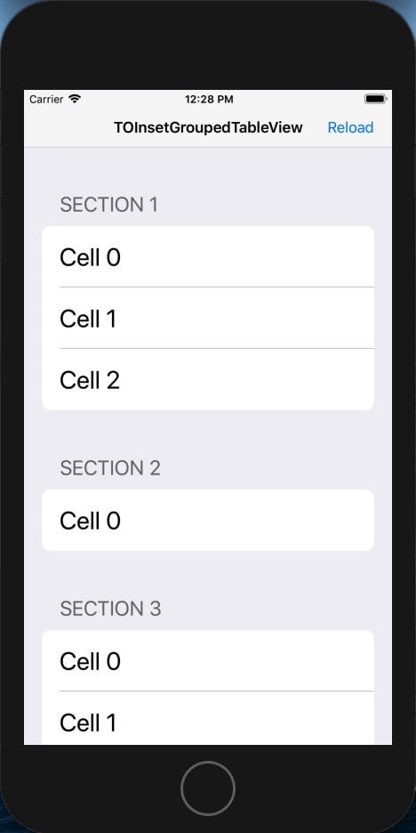

# TOInsetGroupedTableView

## Bug scenario:
OS: iOS 12.0
device: iPhone 8 Plus simulator (have reproduced on physical device in different context)
Run the example project and scroll around the list a bit and then press the "Reload" bar button. It's spotty to reproduce but sometimes the cell at the top of the screen will lose its inset or have the wrong rounding.  

Possibly related to `reloadData`, or maybe custom cell classes/registering custom cells via `UINib`s.  

